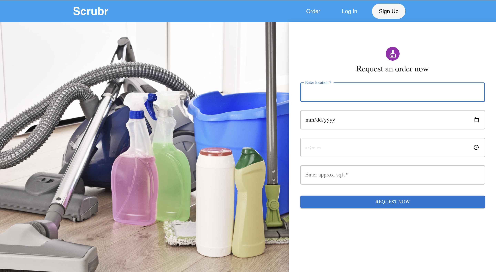

# Scrubr

Scrubr is a full-stack web application that offers on-demand cleaning services. It leverages the power of React and Supabase as the database to provide a seamless user experience. The application utilizes various APIs and technologies, including Express for server-side development, Stripe for payment processing, Google Maps for order location tracking, and Sendinblue for sending SMTP emails to users for receipts confirmation.

## Features

- **User Registration and Authentication**: Users can create accounts, log in, and securely authenticate their identities.
- **Order Placement**: Users can place cleaning service orders, providing details such as date, time, and location.
- **Real-time Order Tracking**: Google Maps API integration enables cleaners to choose cleaning requests based on proximity in real-time.
- **Payment Processing**: Stripe API integration allows users to make secure payments for the cleaning services.
- **Email Notifications**: Sendinblue API integration sends email receipts to users upon successful payment.

## Technologies Used

- **React**: The front-end of the application is built using React, a popular JavaScript library for building user interfaces.
- **Supabase**: Supabase provides a Postgres database with built-in authentication and real-time capabilities.
- **Material-UI**: Material-UI is a React UI framework based on Material Design, offering a wide range of customizable components for building visually appealing user interfaces.
- **Express**: Express is a fast and minimalist web application framework for Node.js, used to create the server-side of the application.
- **Stripe**: Stripe is a widely used payment processing platform that enables secure and seamless online transactions.
- **Google Maps API**: The Google Maps API is used for order location tracking, providing accurate information on the order's progress and estimated arrival times.
- **Sendinblue API**: Sendinblue is an email marketing and automation platform that is used in Scrubr to send SMTP emails to users for receipts.

## Acknowledgments

We would like to express our gratitude to the creators and contributors of the open-source libraries and technologies used in this project. Your hard work and dedication are greatly appreciated.

## Contact

If you have any questions or inquiries regarding Scrubr, please contact us at scrubr123@gmail.com.
